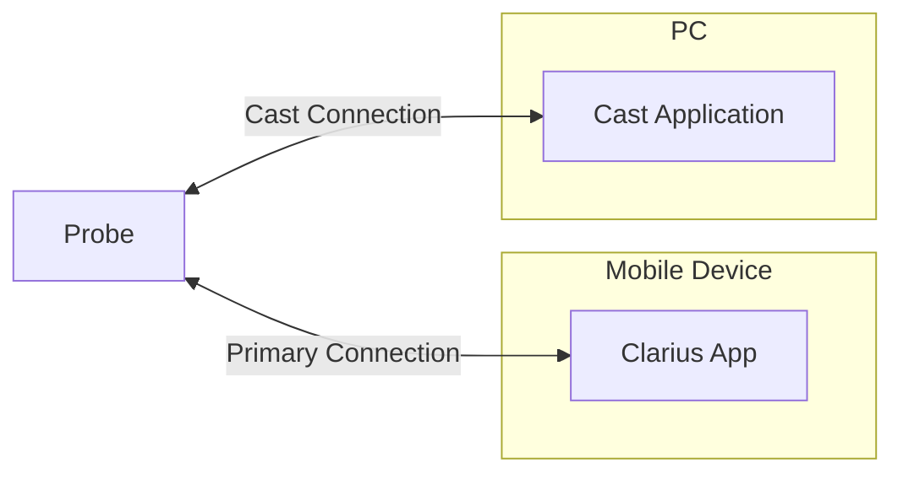
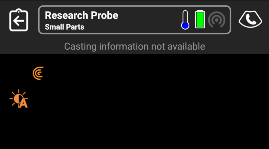
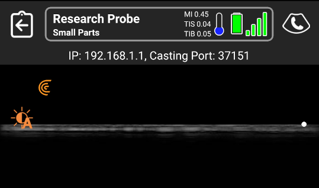
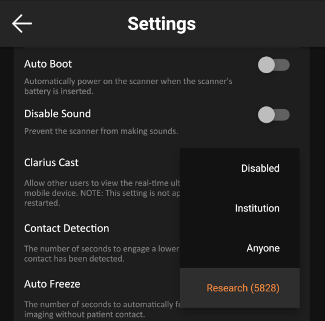

Clarius Cast API
================

This repository contains all related items for the Clarius Cast API

# Overview

The Cast API is based on the Clarius Cast protocol that the Clarius App uses for streaming images to multiple clients at once. It's primary use is for research purposes when access to real-time images is required, the Cast API provides a relatively simple way to get started. The pure C API is deployed on desktop only, primarily because Clarius uses Qt heavily, a library that can often introduce difficulties when deploying or linking on mobile platforms. For commercial users wanting to deploy on mobile, Clarius has created a Java version specifically for interfacing to the Clarius App in an Android environment and an Objective-C framework specifically for interfacing to the Clarius App in an iOS environment.

The Cast API does provide some mechanisms for control of the ultrasound probe, such as the ability to freeze, change parameters such as depth and gain; however these are generally considered secondary functions, as the main purpose of the Cast API is to easily obtain the images in real-time, as opposed to duplicating a control interface.

# Features

- Obtain greyscale and color Doppler **images** (cartesian data) in real-time over the wireless network
- Obtain greyscale and color Doppler **raw images** (polar co-ordinate data) in real-time over the wireless network
- Obtain **9-DOF IMU** data in real-time over the wireless network **
- Obtain **raw data** such as IQ and RF signals once imaging is frozen **
- Obtain interleaved **RF** signals in real-time **
- Set **dimensions** of output images
- Work over a **wireless LAN** or on the **probe's Wi-Fi** network
- Notifications for imaging **freeze and button presses**
- Ability to **freeze** imaging, change basic **imaging parameters**, and change **imaging modes**

** separate software licensing may be required for features to function

# Constraints

- Must be executed while the **Clarius App is running** and connected to a probe, can be the same or different mobile device/PC
- Probe, mobile device, and PC/device must be on the **same wireless network**
- Raw data can only be captured while **imaging is frozen**, except when RF streaming is enabled from the App, in which RF frames are interleaved and streamed over the Cast API when there is a connection

# Releases

- New API binaries and source code get published when Clarius releases a new App
- APIs must be updated to the latest version, there is no backwards or forwards compatibility with older/newer Apps due to a probe firmware check that the library performs upon a connection
- Binaries can be obtained in the [releases](https://github.com/clariusdev/cast/releases) section of the GitHub repositories

# Architecture

The Cast API communicates with the _Clarius Probe_ directly, and makes use of TCP technologies to create a secondary connection to the device that is able to receive images.




# Supported Platforms

- **Windows**: Tested on Windows 10
- **Linux**: Tested on Ubuntu 20.04 and higher
- **macOS**: Tested on macOS 10.15 and higher
- **iOS**: Tested on iOS 13 or higher (note that clients wanting to run side-by-side on same device must use **iPadOS**)
- **Android**: Tested on Android 10 or higher

# Repository

Structure:
- **desktop/src/include**         desktop API headers
- **desktop/src/example**         desktop example programs
- **desktop/src/python**          python examples (import pyclariuscast modules from release package)
- **ios/src/Library**             iOS framework headers (for full framework, download iOS binary zip)
- **ios/src/examples**            iOS example programs
- **android/src/examples**        Android example programs

Desktop Examples:
- **caster** a simple standalone command-line program that must be run with proper input arguments. The Windows version currently requires the boost c++ libraries to be installed for program argument parsing. Images cannot be viewed, however data/images can be captured. A Linux makefile and a Visual Studio solution have been created to help with compilation.
- **caster_qt** a graphical program that allows real-time viewing of the ultrasound stream and implements more functionality than the console program. A Qt Creator project file has been created to help with compilation. A valid compiler and Qt binaries should be installed in order for a proper kit to be defined within the IDE.

iOS Example:
- **cast_swift** a simple SwiftUI program that demonstrates some of the features of the framework. To build, the full iOS framework zip must be extracted to the ../../Library/Frameworks/ path or the path must be adjusted in the project settings. A signing certificate must be specified in the project settings. Ensure that the build target is iOS 64-bit arm to match the downloaded framework. The program demonstrates populating scanner details via bluetooth and image streaming.

Typical Usage:
```
init(callbacks, dimensions)
connect(network_params)

while (input)
  performAction(input)
 
imageCallback(image)
{
  processImage(image)
}
```
# Network Information

The Clarius App will display the network information on a top bar above the image for any probe licensed for the Cast API. The port and IP address are required to make a connection through the Cast API.

|||

Licenced probes also have the option for forcing the port by adjusting the Clarius Cast Permission setting within the App to "Research". This provides a potentially more streamlined method when automating connections from the custom software.

||

Since most connections will be made using the probe's own Wi-Fi network, it is important to ensure the computer running the Cast program is on the same network. Probe networks are typically prefixed with "DIRECT-", and the password is available for 60 seconds on the mobile device clipboard once the Clarius App has connected.

# Notes

- When running under Windows, execution may require temporarily disabling the firewall defender or adding an exception for the executable - the latter is recommended. This is due to the use of randomized ports that the API makes use of for streaming images.
