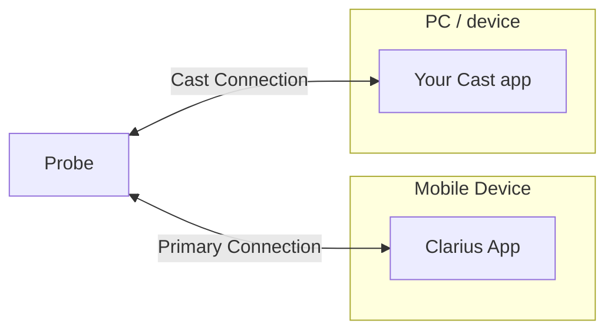

# Getting Started with the Cast API

This guide walks through writing a Cast application: connecting to a probe, receiving
real-time images, controlling basic imaging, and pulling raw data. It targets the
publicly released **v12** API. Snippets are C using the headers in
[`include/cast`](../include/cast); the same sequence applies to the Python
(`pyclariuscast`), Swift, and Android bindings in [`examples`](../examples).

> 🔴 **The Clarius App must be running and connected to a probe to use the Cast API.**
> Cast is a *secondary* connection for streaming — it cannot run stand-alone. The PC or
> device running your Cast program must be on the **same wireless network** as the probe
> and the App. Contrast this with [Solum](https://github.com/clariusdev/solum), which
> connects to the probe directly without the App.

## The big picture



Lifecycle:

```
castInit(callbacks, width, height)
castConnect(ip, port, cert, fn)
  -> imageCallback(image) fires repeatedly
  -> castUserFunction(...) to freeze / change params
castDisconnect()
castDestroy()
```

## 1. Find the network information

For a Cast-licensed probe, the Clarius App shows the probe's IP address and Cast port
when you tap the battery/temperature display area. Both are **required** to connect.

- The address is typically on the probe's own Wi-Fi network (SSID prefixed `DIRECT-`).
  The network password is on the App's **Status** page.
- Optionally set **Clarius Cast Permission → Research** in the App to force the Cast port
  to **5828**, which makes automated connections simpler.

## 2. Initialize

Start from `castDefaultInitParams()`, register callbacks, set the output buffer size, and
call `castInit()`. It must succeed before anything else.

```c
#include <cast/cast.h>

CusInitParams p = castDefaultInitParams();
p.args.argc = argc;
p.args.argv = argv;
p.storeDir  = "/path/to/keys";  // writable dir for security keys
p.width     = 640;
p.height    = 480;

p.newProcessedImageFn = newProcessedImageFn; // scan-converted frames
p.newRawImageFn       = newRawImageFn;        // pre-scan / RF frames
p.newSpectralImageFn  = newSpectralImageFn;   // M / PW spectra
p.newImuDataFn        = newImuDataFn;          // IMU samples
p.freezeFn            = freezeFn;
p.buttonFn            = buttonFn;
p.progressFn          = progressFn;
p.errorFn             = errorFn;

if (castInit(&p) < 0)
    return -1;
```

All callbacks are listed in the [API reference](api-reference.md#callbacks). Functions
return `0` (`CUS_SUCCESS`) / `-1` (`CUS_FAILURE`) unless noted.

## 3. Connect

```c
// pass "research" as the certificate to bypass authentication
castConnect("192.168.1.1", 5828, "research", connectFn);
```

```c
void connectFn(int imagePort, int imuPort, int swRevMatch)
{
    if (imagePort == CUS_FAILURE) { /* connection failed */ return; }
    if (swRevMatch == CUS_FAILURE) {
        // API and App versions mismatch — update the Cast API to match the App
    }
    // imagePort / imuPort are the UDP ports now streaming
}
```

> **Version lock.** The Cast API performs a firmware check on connect and has **no**
> forward/backward compatibility. When Clarius releases a new App, download the matching
> Cast binaries from [releases](https://github.com/clariusdev/cast/releases). A
> `swRevMatch` of `CUS_FAILURE` means your API build doesn't match the running App.

## 4. Receive images

```c
void newProcessedImageFn(const void* img, const CusProcessedImageInfo* nfo,
                         int npos, const CusPosInfo* pos)
{
    // img is nfo->imageSize bytes; default format is 32-bit ARGB.
    // nfo->width x nfo->height; pos[0..npos) carries IMU samples for this frame.
}
```

- Default output is uncompressed 32-bit ARGB; switch with `castSetFormat()` (8-bit gray,
  JPEG, PNG).
- Resize output any time with `castSetOutputSize(w, h)`.
- Call `castSeparateOverlays(1)` to receive grayscale and color/strain overlays as
  separate callbacks.
- Pre-scan-converted (polar) and RF frames arrive on `newRawImageFn`; check `nfo->rf`.
- M-mode and PW spectra arrive on `newSpectralImageFn`.

IMU data streams when enabled in the App; it arrives both tagged on image frames (`pos`)
and via `newImuDataFn`.

## 5. Control imaging

Cast offers *secondary* control — handy, but the App remains the primary UI. Use
`castUserFunction()` with a `CusUserFunction` command:

```c
castUserFunction(Freeze, 0, returnFn);     // toggle freeze
castUserFunction(SetDepth, 7.0, returnFn); // depth in cm
castUserFunction(SetGain, 60.0, returnFn); // gain in %
castUserFunction(ColorDoppler, 0, returnFn); // switch mode
```

Most commands ignore the `val` argument; `SetDepth` and `SetGain` use it. See the full
[command list](parameters.md#user-functions). For lower-level acoustic control there is a
separate set of [research parameters](parameters.md#research-parameters).

## 6. Capture raw data

Raw data (IQ, RF, envelope) is read off the probe once imaging is **frozen** and raw-data
buffering was enabled in the App (the **Buffer** mode icon). The exception is RF
streaming, which interleaves in real time when RF mode is on.

```c
// after freezing (castUserFunction(Freeze, ...))
castRawDataAvailability(availFn);             // 1. list buffered timestamps
castRequestRawData(0, 0, 1, reqFn);           // 2. request all (lzo=1 compresses)
// reqFn returns the byte size to allocate, then:
castReadRawData(&buffer, rawFn);              // 3. download into your buffer
```

`castRequestRawData(start, end, lzo, fn)` selects frames by nanosecond timestamp
(`0,0` = all buffered); `lzo=1` returns an LZO-compressed tarball. The package format is
documented in the [research repository](https://github.com/clariusdev/research).

## 7. Author captures (v12)

The v12 API can compose a capture (image + overlays + labels + measurements) and submit
it back to the exam:

```c
int id = castStartCapture(timestamp);
castAddImageOverlay(id, data, w, h, 1.0f, 0.0f, 0.0f, 0.5f); // red @ 50% opacity
castAddLabelOverlay(id, "ROI", x, y, w, h);
double pts[4] = { x1, y1, x2, y2 };
castAddMeasurement(id, CusMeasurementTypeDistance, "len", pts, 4);
castFinishCapture(id, returnFn);
```

> These capture-authoring functions exist in v12. They are being reworked in v13 — build
> against v12 if you depend on them today.

## 8. Disconnect and clean up

```c
castDisconnect(returnFn);
castDestroy();   // free resources before exiting
```

## Where to go next

- [API reference](api-reference.md) — every function, callback, enum, and struct
- [Parameter reference](parameters.md) — user functions and low-level research parameters
- [Raw data formats](https://github.com/clariusdev/research) — decoding captured IQ/RF/envelope
- Example programs in [`examples`](../examples) (`caster`, `caster_qt`, `python`, Swift, Android)
